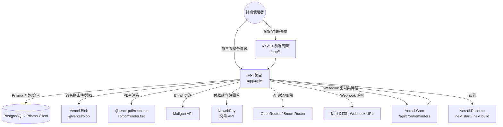
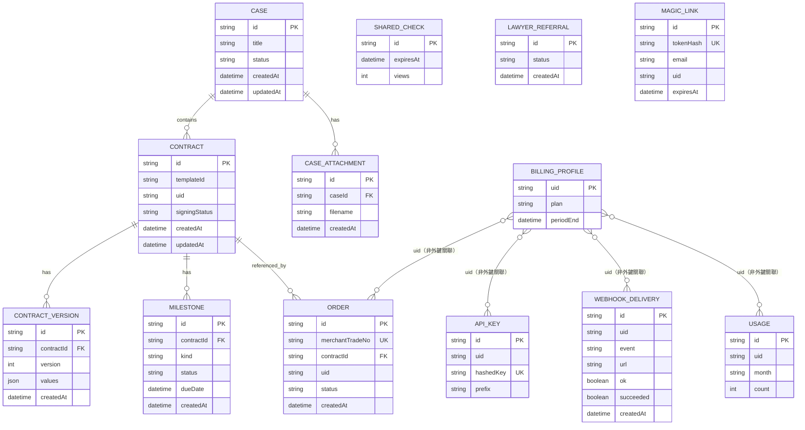

# 系統架構

## 專案總覽
DocGen TW 是以 Next.js App Router 為基礎的台灣法律文件自動化服務，核心目標是：使用者可用表單套用合約範本、送出後產生含法條參考的合約，並支援雙方電子簽署、里程碑提醒、付款升級與 API 簽約串接。服務主要提供給個人接案者、律師團隊與小型商務主體。

## 技術棧

| 類別 | 使用技術 | 依據 |
|---|---|---|
| 應用框架 | `next` `react` | `package.json` `dependencies`、`app/` 路由模式 |
| 語言 | `TypeScript` | `package.json` `devDependencies` |
| ORM / 資料 | `prisma` + `@prisma/client`、`PostgreSQL` | `package.json`、`prisma/schema.prisma` |
| API 風格 | Next.js App Router Route Handlers（`app/api/**/route.ts`） | `app/api` 檔案實作 |
| 文件存放 | `@vercel/blob` | `lib/signing_service.ts`（簽名圖片） |
| PDF | `@react-pdf/renderer` | `lib/pdf/render.tsx` |
| 金流 | 自研 NewebPay 串接 | `lib/payment/newebpay.ts` |
| Mail | Mailgun HTTP | `lib/mailgun.ts` |
| AI/風險檢查（選用） | OpenRouter、Smart Router、`llm-risk.ts` | `lib/openrouter.ts`、`lib/router-client.ts` |
| 部署 | Vercel（含 Cron） | `vercel.json`、`README`、`DEPLOY.md` |
| 測試 | Vitest | `package.json` scripts、`tests/` |

## 架構圖

## 主要目錄結構

| 目錄/檔案 | 用途 |
|---|---|
| `app/` | App Router 頁面與 API Route Handlers（`app/page.tsx`、`app/api/.../route.ts`） |
| `app/api/cron/reminders` | 每日到期提醒與 webhook 重試入口 |
| `app/api/admin/*` | 管理員後台 API（合約/用量/推薦/Webhook） |
| `app/api/v1/contracts` | 對外公開 API（API Key） |
| `components/` | 客戶端 UI 元件（簽名筆、表單步驟、預覽等） |
| `lib/` | 核心商務/資料邏輯（合約、案件、付款、風險、Webhook、Email、JWT 無） |
| `lib/payment/` | NewebPay 參數組裝、簽章與解碼 | 
| `lib/i18n/` | 中文/英文字典與路由文案 |
| `prisma/schema.prisma` | 資料模型定義 |
| `prisma.config.ts` | Prisma 設定（`DATABASE_URL`） |
| `DEPLOY.md` | Vercel/Neon/支付的部署檢核清單 |
| `proxy.ts` | locale proxy 與路徑標頭 |
| `next.config.ts` | Next.js 執行緒與 headers 設定 |

## 資料模型（Prisma）

> 註：部分帳務/權限關聯（例如 `uid` 對應）是以欄位值串接，未使用 Prisma 明確 `@relation`。以程式邏輯仍會同時以 `uid` 進行關聯查詢與保護。
