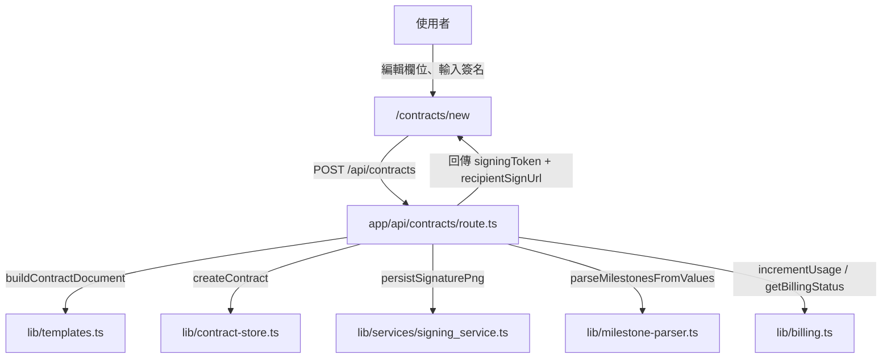
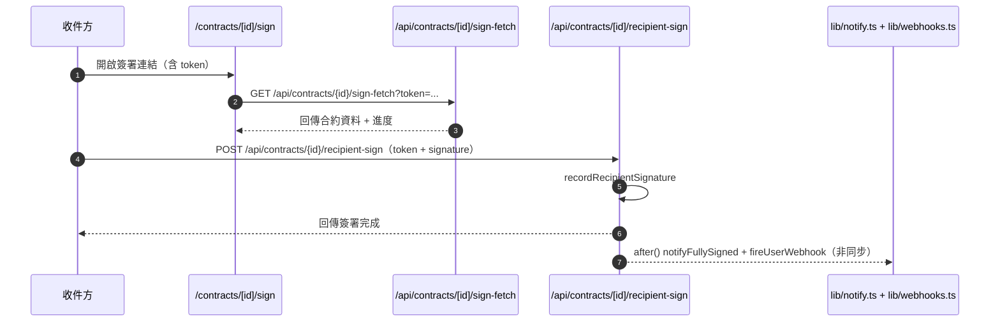
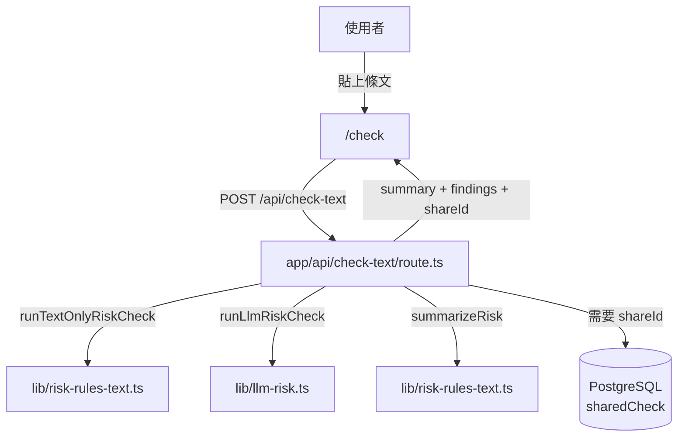
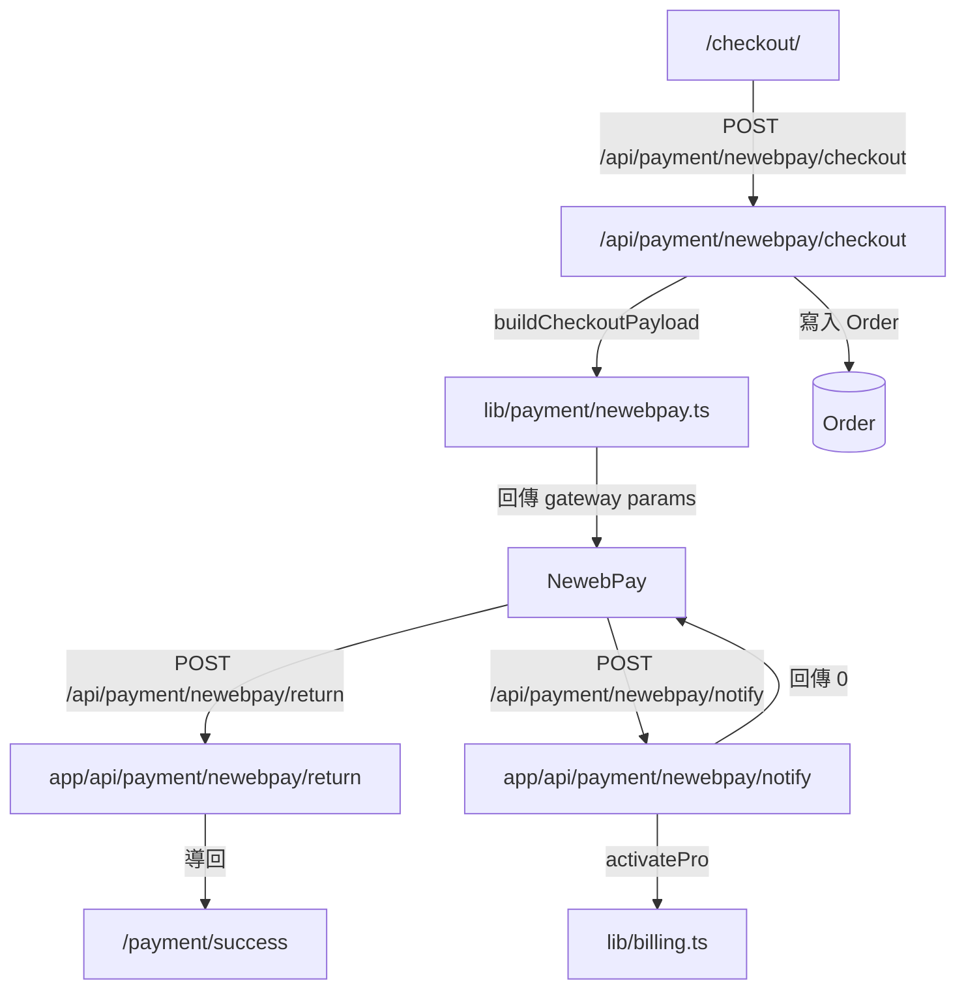
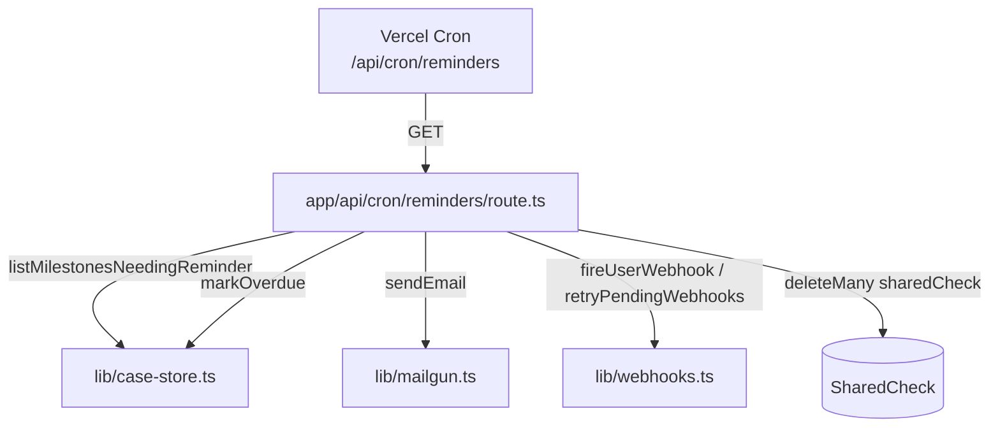

# 操作與業務流程

## 1) 建立合約與寄出簽署連結

使用者在 `/contracts/new` 產生草稿並送出後，後端先判斷 `uid` 與額度，再建立 `Contract`、簽名圖、可選自動里程碑。回傳資料含 `signingToken` 與簽署連結。

## 2) 收件方簽署流程

收件方需憑 token 進入，不需登入。簽署成功後會更新 `Contract.signingStatus`，並觸發 PDF/郵件通知與 webhook。

## 3) 合約風險檢查流程

`/check` 會做規則式掃描並可選啟用 LLM 強化。`/api/check-text` 具備 IP Rate Limit，超過上限會回傳 429。

## 4) 付款啟動到訂閱啟用

`/checkout` 建立 `Order` 後導向藍新付款。實際付款狀態以伺服器 `notify` 為準，成功時透過 `activatePro` 更新 `BillingProfile`。

## 5) 到期提醒 cron 與 webhook 重試

排程每日執行 D7/D1/D0/D+1 提醒，並對未過期未送出的 webhook 做重試，最後回傳本次發送/跳過結果。
