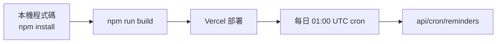

# 安裝、執行、部署與維運

## 環境需求
- Node.js（建議使用 `package.json` 對應的現代版本）
- PostgreSQL 連線（專案 README/DEPLOY 建議使用 Neon）
- 可選：NewebPay、Mailgun、Vercel Blob、OpenRouter

## 安裝與本機啟動
```bash
npm install
npm run dev
```

`npm install` 會在 `postinstall` 觸發 `prisma generate`。

### 常用指令（從 `package.json`）
- `npm run dev`：啟動開發伺服器
- `npm run build`：`prisma generate` → `prisma db push --accept-data-loss --skip-generate` → `next build`
- `npm run start`：啟動 production server
- `npm run lint`：ESLint
- `npm run test`：Vitest
- `npm run db:push`：推送 schema 到資料庫
- `npm run db:migrate`：執行 migrate（`prisma migrate deploy`）

## 環境變數
專案未附 `.env.example`，下列變數皆來自實際 `process.env` 取用。

| 分類 | 變數 | 是否必要 | 說明 |
|---|---|---|---|
| 資料庫 | `DATABASE_POSTGRES_PRISMA_URL` | 是 | Prisma 主要連線（pooled） |
| 資料庫 | `DATABASE_URL_UNPOOLED` | 是 | Prisma migrate 用 direct 連線 |
| 資料庫 | `DATABASE_URL` | 是（多處邏輯判斷） | 供連線可用性與 fallback 流程判斷 |
| Blob 儲存 | `BLOB_READ_WRITE_TOKEN` | 否 | 簽名圖片儲存；未設定會 fallback 到 `public/signatures/`（dev） |
| NewebPay | `NEWEBPAY_MERCHANT_ID` | 否 | 支付店號 |
| NewebPay | `NEWEBPAY_HASH_KEY` | 否 | AES/TradeSha 金鑰 |
| NewebPay | `NEWEBPAY_HASH_IV` | 否 | AES/TradeSha IV |
| NewebPay | `NEWEBPAY_API_BASE` | 否 | API base URL |
| Mailgun | `MAILGUN_API_KEY` | 否 | API Key |
| Mailgun | `MAILGUN_DOMAIN` | 否 | 寄件 domain |
| Mailgun | `MAILGUN_FROM` | 否 | From 地址 |
| Mailgun | `MAILGUN_API_BASE` | 否 | API endpoint |
| AI | `OPENROUTER_API_KEY` | 否 | `/check-text`、`/clause-suggest` 相關 |
| AI | `OPENROUTER_MODEL` | 否 | 可指定模型 |
| AI | `SMART_ROUTER_URL` | 否 | `lib/router-client.ts` 路徑 |
| 站台/運行 | `NEXT_PUBLIC_APP_URL` | 否 | 簽署連結與驗證 redirect origin |
| 站台/運行 | `NEXT_PUBLIC_SITE_URL` | 否 | 部分 API/頁面回呼 origin |
| Cron | `CRON_SECRET` | 否 | `GET /api/cron/reminders` 授權 |
| 安全 | `ADMIN_KEY` | 否（建議） | `/admin` 與 admin API 認證 |
| 通知 | `ADMIN_ALERT_WEBHOOK` | 否 | webhook 告警 |
| 通知 | `WEBHOOK_FAIL_ALERT_THRESHOLD` | 否 | 失敗告警門檻 |
| 轉介 | `REFERRAL_NOTIFY_TO` | 否 | 律師轉介通知信箱 |

> 所有變數僅列變數名，不附任何敏感值。

## 部署方式
### Vercel（既有流程）
1. 連接 Neon PostgreSQL，設定 `DATABASE_POSTGRES_PRISMA_URL`、`DATABASE_URL_UNPOOLED`、`DATABASE_URL`。
2. 設定 `BLOB_READ_WRITE_TOKEN`（若用 Vercel Blob）。
3. 設定 NewebPay/Mailgun 等服務變數。
4. 部署：
```bash
npm run build
vercel --prod
```
5. `vercel.json` 包含排程：
- `GET /api/cron/reminders`，cron `0 1 * * *`

### 其他
repo 未提供 Docker Compose 或 Makefile；請以 Node/Vercel 為主要部署路徑。



## 維運作業
- 移轉：
  - 開發期可用 `npm run db:push`
  - 生產版可用 `npm run db:migrate`
- 付款流程驗證：
  - 建立訂單：`POST /api/payment/newebpay/checkout`
  - 使用測試回報：由 `newebpay/notify` 導向實際 `Order.status`
- Webhook 管控：
  - 每日提醒流程同時呼叫 `retryPendingWebhooks`
  - 管理者可 `POST /api/admin/webhooks/retry` 立即重試
- 清理：
  - `api/cron/reminders` 會清掉到期的 `SharedCheck`

## 已確認腳本/文件
- 部署驗證與 smoke test 規格：`DEPLOY.md`
- 快速上手、API、資料模型、路由索引：本文檔與 `README.md`
